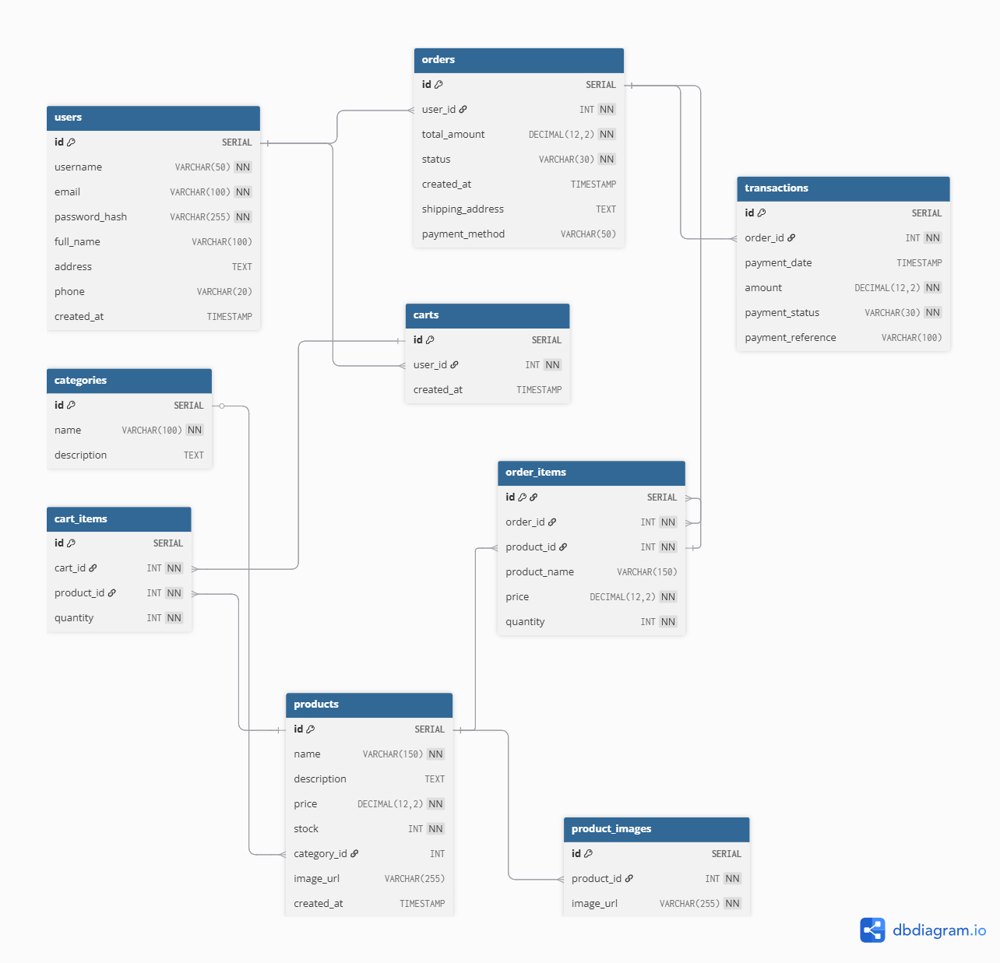

# 🛒 E-Commerce Project  
**Fullstack Web Developer Internship Test**  
PT Tabel Data Informatika

## 📚 Knowledge Base

### 1. Apa yang anda ketahui tentang REST API?
REST API (Representational State Transfer Application Programming Interface) adalah sebuah protokol yang digunakan dalam sistem web berbasis HTTP, yang memfasilitasi komunikasi antara klien dan server. Metode utama yang digunakan pada REST API seperti GET, POST, PUT, dan DELETE digunakan untuk melakukan suatu operasi pada data. REST APPI berperan sebagai jembatan komunikasi yang terstruktur dan terstandar, yang memungkinkan berbagai aplikasi untuk saling berinteraksi secara efektif melalui jaringan internet.

### 2. Apa yang anda ketahui tentang Server Side dan Client Side Processing?
- **Client Side Processing** mengacu pada pemrosesan di sisi klien,dilakukan di browser pengguna menggunakan HTML, CSS, dan JavaScript. Cocok untuk interaksi UI cepat, tapi terbatas dalam keamanan dan kendali akses data.
- **Server Side Processing** pemrosesan yang terjadi di sisi server, dilakukan di server menggunakan bahasa seperti Java (Spring Boot), PHP, Node.js. Cocok untuk validasi, otorisasi, dan interaksi database.

### 3. Apa yang anda ketahui tentang Monolith dan Microservices?
- **Monolith** adalah arsitektur di mana semua bagian aplikasi digabungkan dalam satu aplikasi. Cocok untuk proyek kecil dan pengembangan cepat.  
- **Microservices** memecah aplikasi menjadi layanan-layanan kecil yang independen dan saling terhubung melaui API. Arsitektur ini ideal untuk aplikasi besar karena setiap layanan bisa dikelola secara terpisah.

### 4. Apa yang anda ketahui tentang Design Pattern Inversion of Control (IoC) dan Dependency Injection (DI)?
- **Inversion of Control (IoC)** adalah prinsip di mana kontrol pembuatan objek diserahkan ke framework (misalnya Spring), bukan dibuat secara manual.
- **Dependency Injection (DI)** adalah cara untuk menerapkan IoC, di mana dependensi objek disuntikkan melalui constructor, setter, atau field. DI meningkatkan modularitas dan memudahkan testing.

### 5. Apa yang anda ketahui tentang Java Programming dan Spring Framework khususnya Spring Boot?
**Java** adalah bahasa pemrograman berorientasi objek yang stabil dan banyak digunakan untuk aplikasi skala besar.  
**Spring Boot** adalah framework Java yang menyederhanakan pengembangan aplikasi Spring. Dengan fitur seperti konfigurasi otomatis (auto-configuration) dan server yang sudah terintegrasi (embedded server), Spring Boot membuat proses pengembangan lebih cepat dan efisien.

---

## 🧱 Database Design

Berikut adalah skema database untuk sistem e-commerce:



### Deskripsi Tabel:

- **`users`**  
  Menyimpan data pengguna, termasuk informasi pribadi dan kredensial login seperti nama, email, dan password hash.

- **`products`**  
  Berisi detail produk yang dijual seperti nama, deskripsi, harga, dan jumlah stok tersedia.

- **`categories`**  
  Mengelola kategori dari produk. Satu produk dapat tergolong ke dalam satu kategori.

- **`product_images`**  
  Menyimpan daftar URL gambar yang terasosiasi dengan produk. Satu produk bisa memiliki banyak gambar.

- **`carts`**  
  Menyimpan data keranjang belanja yang dimiliki oleh masing-masing pengguna.

- **`cart_items`**  
  Merupakan penghubung antara keranjang dan produk. Mencatat kuantitas produk yang ditambahkan pengguna ke dalam keranjang.

- **`orders`**  
  Menyimpan data pesanan yang telah selesai di-checkout. Termasuk total harga, status pesanan, dan pengguna terkait.

- **`order_items`**  
  Menyimpan detail produk yang dibeli dalam satu order, mencatat harga dan kuantitas produk saat transaksi dilakukan.

- **`transactions`**  
  Menyimpan informasi pembayaran yang terkait dengan setiap pesanan, termasuk metode pembayaran, status, dan waktu transaksi.

---

## 🧩 Module Design

### Pilihan: **Monolith Architecture**

Karena skenario aplikasi ini berskala kecil hingga menengah, maka dipilih pendekatan monolith agar:
- Proses pengembangan lebih cepat.
- Tidak membutuhkan manajemen layanan kompleks.
- Cukup menggunakan satu aplikasi backend untuk katalog, transaksi, dan keranjang.

---

## ⚙️ Tech Stack

- Java 21
- Spring Boot 3.3.1
- PostgreSQL 15
- Maven
- Spring Data JPA
- RESTful API

---

## 📦 Project Structure (Monorepo)

```bash
ecommerce-test/
├── src/
│   ├── main/
│   │   ├── java/
│   │   │   └── com/nur/ecommerce/ecommerce_test/
│   │   │       ├── controller/
│   │   │       ├── dto/
│   │   │       ├── entity/
│   │   │       ├── repository/
│   │   │       ├── service/
│   │   │       └── EcommerceTestApplication.java
│   │   └── resources/
│   │       └── application.properties
├── pom.xml
└── ...
